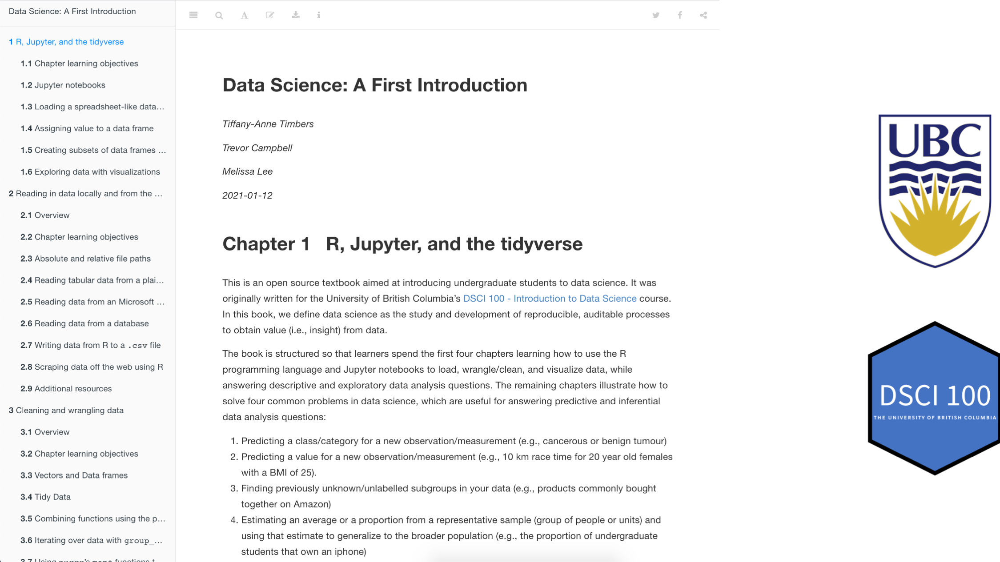

```{r setup, include=FALSE}
options(htmltools.dir.version = FALSE)
library(knitr)
knitr::opts_chunk$set(echo = FALSE)
```

```{r xaringan-themer, include=FALSE, warning=FALSE}
library(xaringanthemer)
style_duo_accent(
  primary_color = "#1381B0",
  secondary_color = "#FF961C",
  inverse_header_color = "#FFFFFF",
  title_slide_background_image="img/open_source_tools_title.png",
  title_slide_background_size = "125%",
  title_slide_background_position = "bottom -20px right -220px;",
  header_font_google = google_font("Open Sans"),
  text_font_google = google_font("Open Sans"),
  code_font_google = google_font("Open Sans")
  #title_slide_text_color = "#1381B0"
)
```

### Why create and use open educational resources (OER's) in general?

--

- cost savings for learners 💸

--

- quick iteration and extension on materials for instructors ♻️ + 🏗️

--

- and raising the quality of the resources by facilitating collaboration 👥👥👥

--

- your teaching materials (and pedagogies) become more discoverable 🔍

---

class: middle

### Why create and use open educational resources in data science?

***All the reasons I just stated, and...***


***... it mirrors the practices, tools and workflows used when practising data science***.

---

class: center, middle

## Practice what you preach!

---

class: middle

### Example of OER's we have built using data science open source tools


1. [*Data Science: A First Introduction*](https://ubc-dsci.github.io/introduction-to-datascience/) - an open textbook aimed at undergraduates students taking their first course in data science

2. [Syllabi, lecture notes, labs and lecture videos from courses for a professional Master's in Data Science program](https://github.com/UBC-MDS/public)

3. [Key Capabilities in Data Science online courses](https://extendedlearning.ubc.ca/programs/key-capabilities-data-science) - Interactive online learning modules aimed at mid-career learners

---

### *Data Science: A First Introduction*

Aimed at first year undergraduates, from any discipline.

.left-column[

```{r dsci-100-team, out.width="50%"}
include_graphics("img/dsci-100-team.png")
```

]

.right-column[

```{r ds-first-intro1, out.width="90%"}

```


]

---

### *Data Science: A First Introduction*

.pull-left[

- Source code is available on GitHub: [github.com/UBC-DSCI/introduction-to-datascience](https://github.com/UBC-DSCI/introduction-to-datascience)

- Created via R + `bookdown` R package.

```{r ds-intro-tools, out.width="30%", fig.align="center"}

```


]

.pull-right[
```{r ds-first-intro-source, out.width="100%"}
include_graphics("img/ds-first-intro-source.png")
```
]
---

### *Data Science: A First Introduction*

.pull-left[
- Book source and rendered HTML version openly licensed under [Creative Commons BY-NC-SA 4.0](https://creativecommons.org/licenses/by-nc-sa/4.0/) and will remain that way indefinitely.

- Partnering with CRC Press to publish and sell a print version. 
]

.pull-right[
```{r ds-first-intro-license, out.width="90%"}

```
]

---

### UBC MDS syllabi, lecture notes, labs & lecture videos

Course resources from the UBC Professional Master of Data Science (MDS) program.

.pull-left[

##### Core (Past and present) MDS teaching team members

- Tomas Beuzen
- Vincenzo Coia
- Giulio Valentino Dalla Riva
- Mike Gelbart
- Varada Kolhatkar
- Rodolfo Lourenzutti
- Firas Moosvi
- Joel Ostblom
- Alexi Rodríguez-Arelis
- Tiffany Timbers

*As well as several external faculty from the  Departments of Statistics and Computer Science.*
]

.pull-right[

```{r mds-hex, out.width="75%"}

```

]

---

### UBC MDS syllabi, lecture notes, labs & lecture videos

.pull-left[
- Course resources from a Master of Data Science program: [github.com/UBC-MDS/public](https://github.com/UBC-MDS/public)

- Program uses open educational resources from others, as well as creates its own

- Syllabi and course notes created via Jupyter, R Markdown & hosted on GitHub

```{r mds-ubc-tools, out.width="90%", fig.align="center"}

```

- Videos of some courses hosted on YouTube

]


.pull-right[

```{r mds-oers, out.width="85%"}

```

]

*Instructors choose to share and distribute their resources using one of the available Creative Commons licenses.*

---

### *Key Capabilities in Data Science* online courses

Online courses and certificate program, aimed at mid-career learners in BC, Canada (but open to anyone).

UBC certificate program: https://extendedlearning.ubc.ca/programs/key-capabilities-data-science

.pull-left[

- Course notes, videos and knowledge checks are openly available.

- Paid version of the courses includes a course facilitator, office hours, graded assignments and quizzes.

```{r kccds-logos, out.width="85%", fig.align="center"}

```

]

.pull-right[

```{r exp-data-viz, out.width="150%"}
include_graphics("img/kccds-team.png")
```

]

---

### *Key Capabilities in Data Science* online courses

Open content created via Ines Montani's open course framework, 
whose front-end is powered by Gatsby and Reveal.js 
and back-end code execution is powered by BinderHub.

- Python course starter pack: [github.com/ines/course-starter-python](https://github.com/ines/course-starter-python)

- R course starter pack: [github.com/ines/course-starter-r](https://github.com/ines/course-starter-r)

.pull-left[
```{r course-starter-pack, out.width="80%"}

```
]

.pull-right[
Other online courses that use this framework (or a derivation of it):
- [GAM's in R](https://noamross.github.io/gams-in-r-course/) by Noam Ross
- [Supervised Machine Learning Case Studies in R](https://supervised-ml-course.netlify.app/) by Julia Silge
- [Allen NLP Guide](https://guide.allennlp.org/) by Allen Institue for AI
]

---

### *Key Capabilities in Data Science* online courses

```{r joel-video, out.width="70%"}
include_graphics("img/joel-video.png")
```

---

### *Key Capabilities in Data Science* online courses

.pull-left[
```{r mcq-exercise, out.width="68%"}

```
]

.pull-right[
```{r code-exercise, out.width="68%"}

```
]

---

class: middle

### *Key Capabilities in Data Science* online courses

| Course open content | Course source | 
|----|---|
| [Programming in Python for Data Science](https://prog-learn.mds.ubc.ca) | [github.com/UBC-MDS/programming-in-python-for-data-science](https://github.com/UBC-MDS/programming-in-python-for-data-science)|
| [Data Visualization](https://viz-learn.mds.ubc.ca/) | [github.com/UBC-MDS/exploratory-data-viz](https://github.com/UBC-MDS/exploratory-data-viz) |
| [Introduction to Machine Learning](https://ml-learn.mds.ubc.ca/en) | [github.com/UBC-MDS/introduction-machine-learning](https://github.com/UBC-MDS/introduction-machine-learning) |

*All content and source is openly licensed under Creative Commons Attribution 4.0 International ([CC BY 4.0](https://creativecommons.org/licenses/by/4.0/https://creativecommons.org/licenses/by/4.0/)).*

---

### Lessons learned from building, sharing and maintaining data science OER's

- don't do it alone

--

- don't be afraid to share works in progress

--

- use a license

--

- maintenance is needed to keep material current

--

- interactive computation requires money and/or infrastructure

---

class: middle

### Impact of our OER's at UBC so far

- ~ 800 students have used *Data Science: A first introduction* as a free, online textbook

- over 300 MDS students have completed MDS using primarily OER's

- over 400 learners have taken the Key Capabilities in Data Science courses and used our open course content

---

### Resources

#### GitHub for sharing teaching resources
- [Creating a course repository to host materials on GitHub.com](https://ubc-dsci.github.io/jupyterdays/sessions/timbers/sharing-materials-with-git/sharing-materials-with-git.html#creating-a-course-repository-to-host-materials-on-github-com)
- [Happy Git with R](https://happygitwithr.com/)

#### Licenses
- [About the Creative Commons licenses](https://creativecommons.org/licenses/)
- [Choosing a Creative Commons license](https://creativecommons.org/choose/)

#### Online book course resources
- [How to write an open online  book with `bookdown`](https://bookdown.org/yihui/rmarkdown/books.html#books) 
- [How to write an open online book with Jupyter book](https://jupyterbook.org/start/your-first-book.html)

#### Online course resources
- [Innes Montani's Python course starter pack](https://github.com/ines/course-starter-python) 
- [Innes Montani's R course starter pack](https://github.com/ines/course-starter-r) 

---

class: center, middle

# Thank-you!
